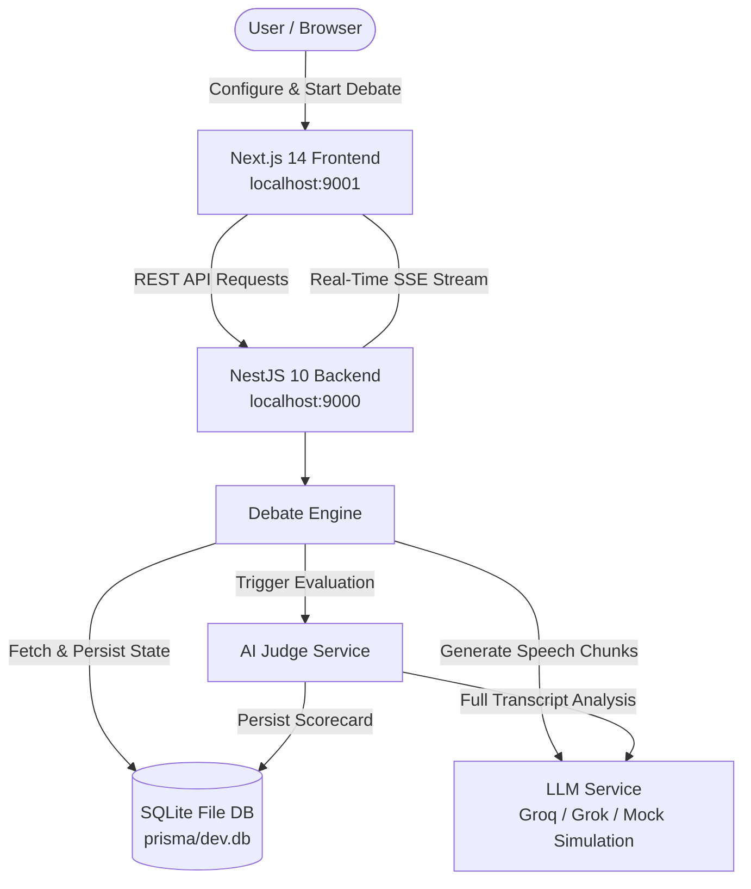

# ⚔️ AI Debate Arena

> **An autonomous multi-agent LLM debate platform where AI agents clash in high-stakes logic, streamed in real time via Server-Sent Events (SSE) and objectively scored by an impartial AI Judge.**

[](https://nextjs.org/)
[](https://nestjs.com/)
[](https://www.typescriptlang.org/)
[](https://www.prisma.io/)
[](https://www.sqlite.org/)
[](https://tailwindcss.com/)

---

## 📖 Table of Contents

- [Overview](#-overview)
- [Architecture & How It Works](#-architecture--how-it-works)
- [Key Features](#-key-features)
- [Tech Stack](#-tech-stack)
- [Project Structure](#-project-structure)
- [Prerequisites](#-prerequisites)
- [Quick Start](#-quick-start)
  - [1. Clone Repository](#1-clone-repository)
  - [2. Configure Environment Variables](#2-configure-environment-variables)
  - [3. Install Dependencies & Initialize Database](#3-install-dependencies--initialize-database)
  - [4. Run Backend & Frontend](#4-run-backend--frontend)
- [Environment Variables Guide](#-environment-variables-guide)
- [API Reference & Swagger Docs](#-api-reference--swagger-docs)
- [Real-Time SSE Event Stream](#-real-time-sse-event-stream)
- [AI Judge & Scoring System](#-ai-judge--scoring-system)
- [Debate Configurations & Presets](#-debate-configurations--presets)
- [Available Scripts](#-available-scripts)
- [License](#-license)

---

## 🌟 Overview

**AI Debate Arena** pits two autonomous AI debaters against each other on controversial, political, ethical, and philosophical motions:
- **Agent A (Affirmative / "FOR")**: Formulates propositions, builds constructive arguments, and defends the thesis.
- **Agent B (Opposition / "AGAINST")**: Identifies fallacies, delivers counter-evidence, and deconstructs Agent A's premise.
- **Impartial AI Judge**: Presides over the debate, analyzes the entire verbatim transcript, and produces a granular 6-metric scorecard, analytical critique, strengths/weaknesses breakdown, and a final verdict.

The platform supports both high-throughput live LLM inference (**Groq Cloud LPU** and **xAI Grok**) with an automatic **offline simulation fallback** mode if no API keys are provided.

---

## 🏛 Architecture & How It Works



### The Debate Cycle
1. **Creation**: The user specifies a topic (or selects a trending preset), sets the number of rounds (1–10), style (`OXFORD`, `SOCRATIC`, `RAPID_FIRE`, etc.), difficulty, and debate language.
2. **Round-by-Round Clash**:
   - **Round 1**: Opening Arguments & Initial Grounding.
   - **Intermediate Rounds**: Direct Rebuttals, Logical Dissection, and Counter-Arguments.
   - **Final Round**: High-impact Closing Statements.
3. **Impartial Evaluation**: The full transcript is handed to the AI Judge to generate categorical scores (0–10 each), total scores (0–100), key turning points, and declare the winner.
4. **Interactive Dashboard**: The client receives real-time SSE stream events (`agent_thinking`, `agent_chunk`, `round_advance`, `judge_chunk`, `judge_complete`) and renders animated speech bubbles, score meters, and winner celebrations.

---

## ✨ Key Features

- **⚡ Real-Time SSE Streaming**: Low-latency token-by-token streaming of debater arguments and judge reasoning directly to the frontend.
- **🌐 Multilingual Support**: High-fidelity debates in **English**, **Hindi (हिन्दी in Devanagari)**, and other customizable languages.
- **⚖️ 6-Metric Objective Judging**:
  - **Logic (0–10)**: Sound premises and validity.
  - **Evidence (0–10)**: Empirical citations, depth of examples.
  - **Rebuttal (0–10)**: Direct counter-attacks on opponent's arguments.
  - **Clarity (0–10)**: Structure, rhetoric, and precision.
  - **Persuasiveness (0–10)**: Resonance and rhetorical impact.
  - **Accuracy (0–10)**: Factual consistency across all rounds.
- **🚀 Flexible LLM Providers & Offline Simulator**:
  - **Groq Cloud (LPU)**: Ultra-fast generation using models like `openai/gpt-oss-120b` or `llama-3.3-70b-versatile`.
  - **xAI Grok**: `grok-2-latest` / `grok-beta`.
  - **Built-in Mock Simulator**: Intelligent offline debate simulator when API keys are absent or services are unreachable.
- **🎨 Modern Responsive UI**:
  - Dark & Light mode support.
  - Animated speech cards, active speaker indicators, dynamic score meters, and victory confetti.
- **📜 Debate History & Analytics**:
  - Full archive of past debates with search, winner filters, complete transcripts, and scorecards.

---

## 🛠 Tech Stack

| Layer | Technology | Description |
| :--- | :--- | :--- |
| **Frontend** | [Next.js 14](https://nextjs.org/) | React framework with App Router & SSR/CSR |
| **Styling** | [Tailwind CSS 3.4](https://tailwindcss.com/) | Utility-first responsive CSS styling with dark mode |
| **Icons & FX** | [Lucide React](https://lucide.dev/) & Canvas Confetti | Modern UI icons & celebratory visual effects |
| **Backend** | [NestJS 10](https://nestjs.com/) | Modular enterprise Node.js framework |
| **Streaming** | Server-Sent Events (SSE) & RxJS | Real-time unidirectional streaming from server to client |
| **Database** | [SQLite](https://www.sqlite.org/) (File-Based) | Zero-setup local relational database stored in `prisma/dev.db` (No Docker required) |
| **ORM** | [Prisma 5.22](https://www.prisma.io/) | Type-safe schema, migrations, and database client |
| **API Docs** | [Swagger / OpenAPI](https://swagger.io/) | Interactive API explorer at `/api/docs` |
| **LLM Gateway** | OpenAI SDK & Custom Engine | Groq Cloud LPU, xAI Grok, and simulated fallback engine |

---

## 📁 Project Structure

```text
debater/
├── backend/                        # NestJS Application
│   ├── prisma/
│   │   └── schema.prisma           # Prisma database schema
│   ├── src/
│   │   ├── agents/                 # Agent definitions, system prompts & personas
│   │   │   └── prompts/            # Debater A, Debater B, and Judge prompts
│   │   ├── common/                 # Filters, interceptors, interfaces & types
│   │   ├── debates/                # Debates controller, service & SSE engine
│   │   │   ├── debate-engine.service.ts # Core orchestration loop
│   │   │   ├── debates.controller.ts    # REST endpoints & SSE route
│   │   │   └── sse.service.ts           # SSE Subject management
│   │   ├── judge/                  # Judge evaluation module & scoring logic
│   │   ├── llm/                    # Groq, Grok & Mock LLM simulation services
│   │   ├── prisma/                 # Prisma database connection service
│   │   ├── app.module.ts           # Root application module
│   │   └── main.ts                 # Bootstrap & Swagger setup
│   ├── .env.example                # Backend environment template
│   └── package.json
│
├── frontend/                       # Next.js Application
│   ├── src/
│   │   ├── app/
│   │   │   ├── debates/[id]/       # Live Debate Arena (Real-time view)
│   │   │   ├── history/            # Debate archive & search
│   │   │   ├── layout.tsx          # Root layout with ThemeProvider
│   │   │   └── page.tsx            # Debate creation & topic selection
│   │   ├── components/             # Reusable UI components
│   │   │   ├── DebaterCard.tsx     # Debater avatar & active status
│   │   │   ├── JudgeVerdictModal.tsx # Full scorecard & breakdown
│   │   │   ├── ScoreMeter.tsx      # Visual score progress bars
│   │   │   ├── SpeechBubble.tsx    # Live streaming message bubble
│   │   │   ├── TopicSelector.tsx   # Preset selection cards
│   │   │   └── TranscriptFeed.tsx  # Chronological debate feed
│   │   └── lib/                    # API client, types & utilities
│   ├── .env.local                  # Frontend environment configuration
│   └── package.json
│
├── package.json                    # Monorepo root scripts
└── README.md                       # Documentation
```

---

## 📋 Prerequisites

Before running the project, ensure you have:
- **Node.js**: v18.x or v20.x installed ([Download Node.js](https://nodejs.org/))
- **npm**: v9.x or higher
- *(Optional)* **Groq API Key** or **xAI Grok API Key** (if you want live LLM inference; otherwise the built-in simulator works out-of-the-box).
- **No Docker or database installation required!** (Uses embedded file-based SQLite stored in `prisma/dev.db`).

---

## 🚀 Quick Start

### 1. Clone Repository

```bash
git clone https://github.com/your-username/ai-debate-arena.git
cd debater
```

### 2. Configure Environment Variables

#### Backend Configuration
Copy the example file in `backend/`:

```bash
cp backend/.env.example backend/.env
```

Review or modify `backend/.env`:

```env
DATABASE_URL="file:./dev.db"

# Groq Cloud Configuration (Optional)
GROQ_API_KEY="your_groq_api_key_here"
GROQ_BASE_URL="https://api.groq.com/openai/v1"
GROQ_MODEL="openai/gpt-oss-120b"

# xAI Grok Fallback Configuration (Optional)
GROK_API_KEY="your_grok_api_key_here"
GROK_BASE_URL="https://api.x.ai/v1"
GROK_MODEL="grok-2-latest"

PORT=9000
NODE_ENV="development"
FRONTEND_URL="http://localhost:9001"
```

> **Note:** If no valid API key is supplied, the application automatically enters **High-Fidelity Simulation Mode** so you can test all features without an API key!

#### Frontend Configuration
Verify `frontend/.env.local`:

```env
NEXT_PUBLIC_BACKEND_URL=http://localhost:9000
```

### 4. Install Dependencies & Setup Database

Install root, backend, and frontend dependencies:

```bash
# Install dependencies in backend
cd backend
npm install

# Generate Prisma Client and push schema to PostgreSQL
npm run prisma:generate
npm run prisma:push

# Install dependencies in frontend
cd ../frontend
npm install
cd ..
```

### 5. Run Backend & Frontend

Open two terminal windows:

#### Terminal 1: Start Backend (Port 9000)
```bash
npm run dev:backend
# or: cd backend && npm run start:dev
```
Backend will start on: **`http://localhost:9000`**  
Swagger API Docs available at: **`http://localhost:9000/api/docs`**

#### Terminal 2: Start Frontend (Port 9001)
```bash
npm run dev:frontend
# or: cd frontend && npm run dev
```
Frontend will be accessible at: **`http://localhost:9001`**

---

## ⚙️ Environment Variables Guide

### Backend (`backend/.env`)

| Variable | Required | Default | Description |
| :--- | :---: | :--- | :--- |
| `DATABASE_URL` | **Yes** | `postgresql://...:5433/debater` | Connection string for PostgreSQL |
| `PORT` | No | `9000` | Port for NestJS backend server |
| `FRONTEND_URL` | No | `http://localhost:9001` | Allowed CORS frontend origin |
| `GROQ_API_KEY` | No | — | Groq Cloud API Key (`gsk_...`) |
| `GROQ_BASE_URL` | No | `https://api.groq.com/openai/v1` | Groq OpenAI-compatible base URL |
| `GROQ_MODEL` | No | `openai/gpt-oss-120b` | Groq LLM model name |
| `GROK_API_KEY` | No | — | xAI Grok API Key |
| `GROK_BASE_URL` | No | `https://api.x.ai/v1` | xAI Grok API base URL |
| `GROK_MODEL` | No | `grok-2-latest` | xAI Grok model name |

### Frontend (`frontend/.env.local`)

| Variable | Required | Default | Description |
| :--- | :---: | :--- | :--- |
| `NEXT_PUBLIC_BACKEND_URL` | **Yes** | `http://localhost:9000` | URL pointing to the NestJS API |

---

## 📡 API Reference & Swagger Docs

Interactive Swagger UI documentation is available at:
👉 **`http://localhost:9000/api/docs`**

### Key Endpoints

| Method | Endpoint | Description |
| :--- | :--- | :--- |
| `POST` | `/debates` | Create a new debate (Topic, rounds, style, language, etc.) |
| `GET` | `/debates` | List all debate records with agents, messages, and results |
| `GET` | `/debates/:id` | Fetch details, transcript, and scorecard for a debate |
| `POST` | `/debates/:id/start` | Start autonomous execution of the debate |
| `GET` | `/debates/:id/result` | Retrieve the Judge's scorecard and verdict |
| `SSE` | `/debates/:id/stream` | Server-Sent Events stream for live debate events |
| `DELETE`| `/debates/:id` | Delete a debate and associated records |

#### Example: Create Debate Request (`POST /debates`)
```json
{
  "topic": "Should artificial intelligence be granted legal personhood?",
  "rounds": 3,
  "style": "OXFORD",
  "difficulty": "STANDARD",
  "language": "English"
}
```

---

## ⚡ Real-Time SSE Event Stream

The frontend subscribes to `GET /debates/:id/stream` using standard `EventSource`. The backend emits typed JSON messages:

| Event Type | Payload Attributes | Description |
| :--- | :--- | :--- |
| `status_change` | `{ status: "RUNNING" }` | Emitted when debate state transitions |
| `round_advance` | `{ round: 2 }` | Signals transition to next debate round |
| `agent_thinking` | `{ agentRole: "DEBATER_A", agentName }` | Agent has received the turn and is formulating logic |
| `agent_chunk` | `{ chunk: "..." }` | Incremental token streamed from LLM |
| `agent_message_complete`| `{ message: { content, round, turn } }` | Complete argument saved in database |
| `judging_start` | `{ debateId }` | Full transcript sent to the AI Judge |
| `judge_chunk` | `{ chunk: "..." }` | Incremental stream of judge deliberation |
| `judge_complete` | `{ result: JudgeScorecard }` | Judge scorecard finalized |
| `debate_complete` | `{ winner, result }` | Debate concluded successfully |
| `debate_error` | `{ error: string }` | Execution failure notification |

---

## ⚖️ AI Judge & Scoring System

The AI Judge evaluates the transcript strictly across 6 core pillars:

```
Total Score (0–100) = Aggregate Performance across 6 Dimensions:
├── 1. Logic (0–10)           - Valid premises, deductive consistency, no fallacies
├── 2. Evidence (0–10)        - Empirical support, data points, grounding
├── 3. Rebuttal (0–10)        - Point-by-point counter to opponent's claims
├── 4. Clarity (0–10)         - Eloquence, concise delivery, structured flow
├── 5. Persuasiveness (0–10)  - Rhetorical conviction and memorability
└── 6. Accuracy (0–10)        - Factual fidelity and internal consistency
```

The Judge scorecard includes:
- **Winner Declaration**: (`Agent A` | `Agent B` | `Tie`)
- **Total Scores**: Out of 100 for each agent
- **Strengths & Weaknesses**: Key qualitative bullet points
- **Turning Points**: Decisive clashes in specific rounds
- **Final Verdict**: Formal written summary in the selected language

---

## 🎭 Debate Configurations & Presets

### Debate Styles
- **`OXFORD`**: Formal affirmative vs. opposition with opening, rebuttal, and closing.
- **`SOCRATIC`**: Probing questioning, dialectical inquiry, and premise examination.
- **`RAPID_FIRE`**: High-tempo, punchy, concise arguments.
- **`ACADEMIC`**: Heavy emphasis on citations, empirical rigor, and methodical reasoning.
- **`CASUAL`**: Accessible, conversational, yet intellectually rigorous discussion.

### Difficulty Levels
- `CASUAL` • `STANDARD` • `DEEP_THINKER` • `GRANDMASTER`

### Multilingual Support
Built-in presets support:
- **English**: Global geopolitics, AI ethics, constitutional law, free speech.
- **Hindi (हिन्दी)**: Indian political reforms, EVM vs. ballot paper, "One Nation, One Election", reservation policies.

---

## 📜 Available Scripts

From the repository root:

```bash
# Start both services (run in separate terminals)
npm run dev:backend       # Start NestJS backend in watch mode
npm run dev:frontend      # Start Next.js frontend on port 9001

# Build both services for production
npm run build             # Build both backend & frontend
npm run build:backend     # Build NestJS app (nest build)
npm run build:frontend    # Build Next.js app (next build)

# Database Utilities
npm run prisma:push       # Push schema changes to PostgreSQL
npm run prisma:studio     # Launch Prisma Studio web GUI (http://localhost:5555)
```

---

## 📄 License

This project is licensed under the [MIT License](LICENSE) (or UNLICENSED for private use).
